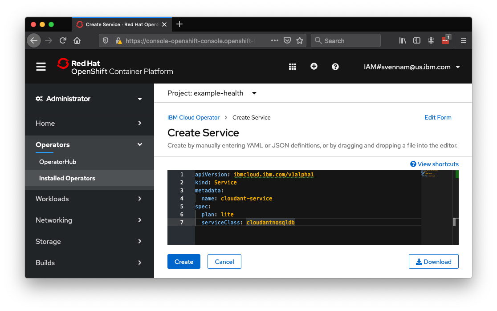

# Exercise 6: Patient Database for Example Health

Currently, the Example Health `patient-ui` app is using a dummy in-memory patient. In this exercise, you'll create a Cloudant service in IBM Cloud and populate it with patient data. Cloudant is a NoSQL database-as-a-service, based on CouchDB.


## Enable the IBM Cloud Operator

It's crucial to understand exactly how Operators work. In the first exercise, you deployed a simple application using a DeploymentConfig and Pods -- these are "default resources" that come with OpenShift. A custom resource definition allows you to create resources that are not necessarily running within Kubernetes, such an IBM Cloud service. Operators manage the lifecycle of resources and create CRDs, allowing you to manage custom resources the native "Kubernetes" way.

1. Navigate to your OpenShift console, access the `Administrator` view, and click `Operators > OperatorHub`

    

1. Find the "IBM Cloud Operator", and hit "Install"

    

1. Keep the default options and hit `Subscribe`:

    

1. You may need to wait a few seconds and refresh for the operator to show up as `Installed`:

    
 
1. Next, you'll need to set your IBM Cloud credentials so that the Operator knows how/where to create your Cloudant service. The operator needs to create the service in your own account, rather than the shared IBM lab account.

    ```shell
    ibmcloud login --sso
    ```

    
    Remember: Pick your own account, not IBM.
    

    ```shell
    Select an account:
    1. Sai Vennam's Account (d815248d6ad0cc354df42d43db45ce09) <-> 1909673
    2. IBM (3a4766a7bcab032d4ffc980d360fbf23) <-> 338150
    Enter a number> 1
    ```

1. Next, set your CF org, space and resource group where the Cloudant service will be created. Resource group is usually named `default` or `Default` -- case-sensitive.

    ```shell
    ibmcloud target --cf -g Default
    or
    ibmcloud target --cf -g default
    ```

1. Verify that all fields are set:

    ```shell
    ibmcloud target
    ```

    ```shell
    API endpoint:      https://cloud.ibm.com   
    Region:            us-south   
    User:              svennam@us.ibm.com   
    Account:           Sai Vennam's Account (d815248d6ad0cc354df42d43db45ce09) <-> 1909673   
    Resource group:    default   
    CF API endpoint:   https://api.us-south.cf.cloud.ibm.com (API version: 2.144.0)   
    Org:               svennam@us.ibm.com   
    Space:             dev   
    ```

    
    If any of these fields are not set, the Operator will fail to create your service!
    

1. Use the helper script provided by IBM to create a new API token, and register it as a secret in your OpenShift cluster:

    ```shell
    curl -sL https://raw.githubusercontent.com/IBM/cloud-operators/master/hack/install-operator.sh | bash
    ```

1. Verify that all the fields in `data` are set for the configmap (`org`, `region`, `resourceGroup` and `space`) and secret (`api-key` and `region`):

    ```shell
    oc get configmap/seed-defaults -o yaml -n default
    oc get secret/seed-secret -o yaml -n default
    ```

    ```shell
    apiVersion: v1
    data:
        org: svennam@us.ibm.com
        region: us-south
        resourceGroup: default
        space: dev
    ...
 
    apiVersion: v1
    data:
        api-key: <PRIVATE_API_TOKEN>=
        region: dXMtc291dGg=
    ...
    ```

## Create a Cloudant Service using the CRDs

1. Once the Operator is installed, the Custom Resource Definitions to create the Cloudant service are also available. Navigate to your OpenShift dashboard, ensure you're in the `Administrator` view, navigate to your `Installed Operators` and click the IBM Cloud Operator:

    

1. You'll see that there's two APIs available -- a Service and a Binding. A `Service` will allow us to create the actual Cloudant service itself -- do that first by clicking `Create Instance` under `Service`. Copy and replace the following YAML:

    ```shell
    apiVersion: ibmcloud.ibm.com/v1alpha1
    kind: Service
    metadata:
      name: cloudant-service
    spec:
      plan: lite
      serviceClass: cloudantnosqldb
    ```

    

    Hit `Create`.

1. Wait a couple minutes for the service to provision. You can check the status by clicking on your service, and looking for `Message: Online`:

    
    You can also debug any potential issues here. If you already have a Cloudant "Lite" service, you won't be able to create another.
    

    

1. After verifying that there's no bugs and the service is "online", double-check that the Cloudant service exists in your account: https://cloud.ibm.com/resources

    
    You may need to switch to your own account using the switcher on the top right.
    

    

1. Next, create the "binding" resource for your Operator (instead of Service as you did above):

    ```shell
    apiVersion: ibmcloud.ibm.com/v1alpha1
    kind: Binding
    metadata:
      name: cloudant-binding
    spec:
      serviceName: cloudant-service
    ```

    

1. The binding should get created fairly quickly -- you can check the status by clicking on your binding, and looking for `Message: Online`. By navigating to the `Resources` tab, you can see that the `cloudant-binding` secret is created. Click that to see your credentials for accessing your Cloudant DB, stored securely in a secret:

    

## Deploy the Node.js Patient Database App

Now you'll create the Node.js app that will populate your Cloudant DB with patient data. It will also serve data to the front-end application that we deployed in the first exercise. 

1. Run the following command to create this application:

    ```
    oc new-app --name=patient-db centos/nodejs-10-centos7~https://github.com/svennam92/nodejs-patientdb-cloudant
    ```

1. The app will crash and fail to start repeatedly because the credentials to the Cloudant DB haven't been set yet. 

    

1. Let's fix this by setting the environment variable to the `cloudant-binding` secret we created earlier. Navigate to the deployment config for this app:

    

1. Go to the `Environment` tab, click `Add from Config Map or Secret` and create a new environment variable named `CLOUDANT_URL`. Choose the `cloudant-binding` secret, then choose `url` for the Key. Hit the `Save` button.

    

1. Go back to the `Topology` tab, and the `patient-db` should successfully start shortly.

    

## Configure Front-End Patient Health App to use Cloudant Database Backend

The `patient-ui` application has a configuration option for the backend database. To start using the database you configured above, follow the steps below to configure it.

1. Access your `patient-ui` application again and click `Settings`.

    
    To find your routes, you can use the OpenShift console or type `oc get routes`.
    

    

1. Input the route `http://patient-db:8080/` and hit the `node` OpenShift icon.

    
    You won't need to expose this application with the `oc expose` command. This is because your frontend `patient-ui` application can talk to the backend `patient-db` without the network request leaving the cluster. Kubernetes keeps an internal DNS record of the services which resolve to the IPs of the running application.
    

    

Your application is now backed by the mock patient data in the Cloudant DB! You can log-in using any user-id/password in the Cloudant DB, for example "opall:opall".

1. To find the complete set of users, navigate to your services in IBM Cloud: [IBM Cloud Resources](https://cloud.ibm.com/resources). Click `cloudant-service`.

    

1. Launch the Cloudant dashboard and click the `patients` db.

    

1. Click through the different patients you can log-in as.

    