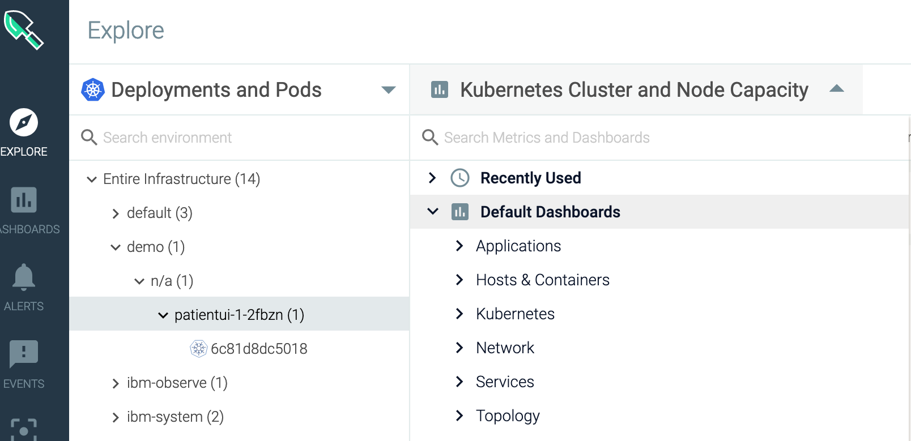

# Exercise 10: Monitor your Cluster with SysDig

IBM Cloud Monitoring with Sysdig is a co-branded cloud-native, and container- intelligence management system that you can include as part of your IBM Cloud architecture. Use it to gain operational visibility into the performance and health of your applications, services, and platforms. It offers administrators, DevOps teams, and developers full stack telemetry with advanced features to monitor and troubleshoot performance issues, define alerts, and design custom dashboards. IBM Cloud Monitoring with Sysdig is operated by Sysdig in partnership with IBM.

The following diagram shows the components overview for the IBM Cloud Monitoring with Sysdig service that is running on IBM Cloud:

When you monitor an application, you should consider:

* Monitoring the health of the application

  The health signals coming from hardware and software components

  Utilization, Saturations and Errors \(USE\): resource usage and capacity limits, CPU, memory, disk I/O, network against host or container limits

* Monitoring the golden signals that focus on perceived service quality

  Latency of HTTP calls, both average and worst case ones

  Traffic, that is, rate of requests per second

  Errors and their frequency
  

## Features

**Accelerate the diagnosis and resolution of performance incidents.**

IBM Cloud Monitoring with Sysdig offers deep visibility into your infrastructure and applications with the ability to troubleshoot from service level all the way down to the system level. Pre-defined dashboards and alerts simplify identification of potential threats or problems. By using IBM Cloud Monitoring with Sysdig, developers and DevOps teams monitor and troubleshoot performance issues in real-time, identify the source of errors, and eliminate problems.

**Control the cost of your monitoring infrastructure.**

IBM Cloud Monitoring with Sysdig includes functionality that helps you to control the cost of your monitoring infrastructure in IBM Cloud. You can configure the metric sources for which you want to monitor performance. You can enable a pre-defined alert to warn you of usage changes that will impact your billing.

**Explore and visualize easily your entire environment.**

IBM Cloud Monitoring with Sysdig makes it easier to visually explore your environment. Dynamic topology maps provide a view of dependencies between services. Multi- dimensional queries across high churn, high cardinality, high frequency metrics accelerate troubleshooting. Customizable dashboards allow you to visualize what matters most.

**Get critical Kubernetes and container insights for dynamic microservice monitoring.**

IBM Cloud Monitoring with Sysdig auto-discovers Kubernetes environments and provides out-of-the-box dashboards and alerts for clusters, nodes, namespaces, services, deployments, pods, and more. A single agent per node dynamically discovers all microservices and auto-collects metrics and events from various sources including Kubernetes, hosts, networks, containers, processes, applications, and custom metrics like Prometheus, JMX, and StatsD.

**Mitigate the impact of abnormal situations with proactive notifications.**

IBM Cloud Monitoring with Sysdig includes alerts and multi-channel notifications that you can use to reduce the impact on your day-to-day operations and accelerate your reaction and response time to anomalies, downtime, and performance degradation. Notification channels that you can easily configure
include email, Slack, PagerDuty, webhooks, Opsgenie, and VictorOps.

In the next steps, you will learn how to use dashboards and metrics to monitor the health of your application.

### Launch the web UI

You launch the Web UI within the context of an Sysdig instance, from the IBM Cloud UI.

Complete the following steps to launch the web UI:

1. In the LogDNA web UI, click the **Views** icon  &gt; **Observability**.

2. Select **Monitoring**.

   The list of instances that are available is displayed.

3. Select the instance that is allocated for your lab. Then, click **View Sysdig**.

The Web UI opens.

## View SysDig pre-defined views and dashboards

**Use views and dashboards to monitor your infrastructure, applications, and services. You can use pre-defined dashboards. You can also create custom dashboards through the Web UI or programmatically. You can backup and restore dashboards by using Python scripts.**

The following table lists the different types of pre-defined dashboards:

| Type | Description | 
| :--- | :--- |
| Applications | Dashboards that you can use to monitor your applications and infrastructure components. |
| Host and containers | Dashboards that you can use to monitor resource utilization and system activity on your hosts and in your containers. |
| Network | Dashboards that you can use to monitor your network connections and activity. | 
| Service | Dashboards that you can use to monitor the performance of your services, even if those services are deployed in orchestrated containers. | 
| Topology | Dashboards that you can use to monitor the logical dependencies of your application tiers and overlay metrics. | 

Complete the following steps to view a Sysdig dashboard:

1. After you launch the Sysdig web UI, in the Sysdig Welcome wizard, select **Kubernetes** as the installation method.

   After 30 seconds or so, it should show one or more agents connected.

   Select **GO TO NEXT STEP**.

   Then select **LET'S GET STARTED**.

2. Navigate the Sysdig console to get metrics on your Kubernetes cluster, nodes, deployments, pods, containers. Explore the following views:
3. View raw metrics for all workloads running on the cluster.

   Under the _Explore_ section,

   

   Select **Containerized Apps** to view raw metrics for all workloads running on the cluster.

4. Get a global view of the cluster HTTP load.

   Under Dashboard,

   

   Select **My Dashboards**. Then select **HTTP Overview** to get a global view of the cluster HTTP load.

5. Check how nodes are currently performing.

   Under Dashboard, select **My Dashboards**. Then select **Overview by Host** to understand how nodes are currently performing.

6. Check information about the sample app _patientui_.

   Under _Explore_, select **Cluster and Nodes**. Expand the section **Entire Infrastructure**. Look for the partientui pod entry.

   

### Explore the normal traffic flow of the application

You can use the **Connection Table** dashboard to monitor how data flows between your application components.

1. From the _Explore_ tab, select **Deployments and Pods.**
2. Select the namespace where you deployed your sample app.

   

3. Select the _patientui_ pod entry.

   

4. Select **Default Dashboards**.

   

5. Select **Hosts & Containers**. Then, select **Overview by Host**.

   

6. Select **Hosts & Containers**. Then, select **Overview by Container**.

   

   The **Overview by Container** view opens. Look at the different columns and the data.

   

### Explore the cluster and the node capacity

1. From the _Explore_ tab, select **Deployments and Pods.**
2. Select the namespace where you deployed your sample app.

   

3. Select the _patientui_ pod entry.

   

4. Select **Default Dashboards**.

   

5. Select **Kubernetes Cluster**. Then, select **Node capacity**.

   

   The view **Kubernetes Cluster and Node Capacity** opens.

   

   Check the **Total CPU Capacity**. This is the CPU capacity that has been reserved for the node including system daemons.

   Check the **Total Allocatable CPU**. This is the CPU which is available for pods excluding system daemons.

   Check the **Total Pod CPU limit**. It should be less than the allocatable CPU of the node or cluster.

   Check the **Total Pod CPU Requested**. It is the amount of CPU that will be guaranteed for pods on the node or cluster.

   Check the **Total Pod CPU Usage**. It is the total amount of CPU that is used by all Pods on the node or cluster.

### Explore the Network

1. From the _DASHBOARDS_ tab, select **My Dashboards**. Then, select **Network Overview**.

   

   The following dashboard is displayed. It shows information about all resources that are monitored thorugh the instance.

   

2. Change the scope of the dashboard to display information about your openshift cluster. Select **Edit scope**

    

    Change the scope.

    

    The dashboard shows information about the ibm-observe namespace.

    

